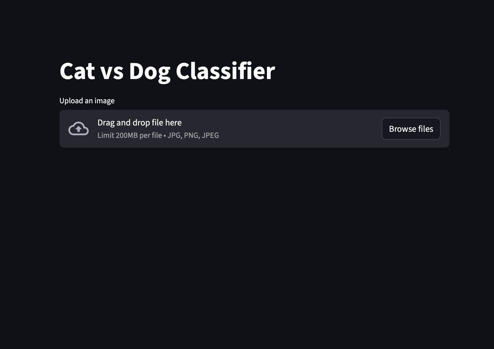
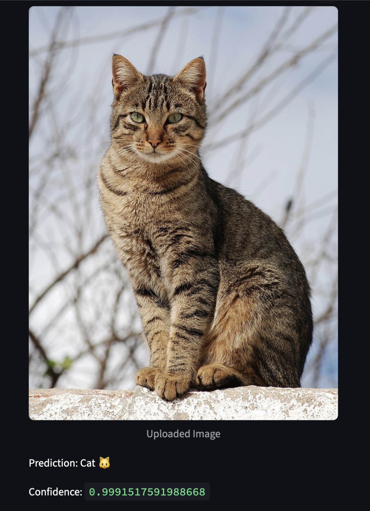

# Cat vs Dog Prediction AI 🐱🐶

This project is a deep learning image classifier that distinguishes between **cats and dogs**.  
The model is trained using TensorFlow with the pretrained EfficientNetB0 architecture and deployed using a Streamlit web application for real-time predictions.

---

## Application Screenshots

### Streamlit Web Interface

### Prediction Example

---

## Project Overview

The objective of this project is to build an image classification model that can identify whether an image contains a **cat** or a **dog**.

The model uses **transfer learning** with EfficientNetB0, a powerful convolutional neural network pretrained on the ImageNet dataset.  
This allows the model to achieve high accuracy while requiring less training time.

Users can upload an image through the Streamlit interface and receive an instant prediction.

---

## Features

- Cat vs Dog image classification
- Transfer learning using EfficientNetB0
- GPU-accelerated model training
- Interactive Streamlit web interface
- High validation accuracy (~99%)

---

## Technologies Used

- Python
- TensorFlow / Keras
- EfficientNetB0
- Streamlit
- NumPy
- Pillow

---

## Dataset

The model is trained on the **Microsoft Cats vs Dogs dataset**.

Dataset details:

- 12,500 cat images
- 12,500 dog images

The dataset is divided into training and validation sets for model evaluation.

---

## Model Architecture

The model uses **transfer learning** with EfficientNetB0.

Pipeline:

Image → EfficientNetB0 Feature Extractor → Global Average Pooling → Dense Layer → Binary Classification

EfficientNetB0 is pretrained on the ImageNet dataset and provides powerful feature extraction for image recognition tasks.

---

## Model Performance

Training results:

- Training Accuracy: ~98%
- Validation Accuracy: ~99%
- Validation Loss: ~0.02

These results show strong performance for binary image classification.

---

## Installation

Clone the repository
